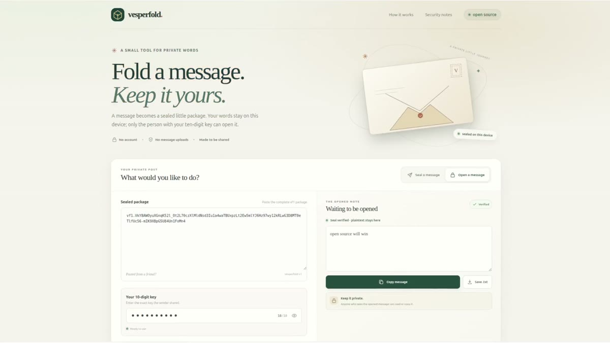

# Vesperfold

**Fold a message. Share the key.** Vesperfold is a local-first text sealer: encrypt a note into a portable `vf1.` package, then let someone open it with the exact ten-digit key.

> **Security boundary:** a random ten-digit key has 10 billion possibilities (about 33 bits). Argon2id raises the cost of each guess, but anyone with a copy of a package can try guesses offline. Vesperfold supports ten-digit keys only and is for casual privacy, not high-risk or long-term secrets. For stronger protection, choose a different tool that supports a long random passphrase or cryptographic key. This project has not had an independent security audit.

## Demo

[](public/vesperfold-demo.mp4)

The screen recording shows a sample message being sealed into a `vf1.` package and opened again with its key.

## What it does

- Encrypts and decrypts text entirely in the browser. There is no Vesperfold account, message server, analytics, or telemetry.
- Uses Argon2id and XChaCha20-Poly1305 through [libsodium.js](https://github.com/jedisct1/libsodium.js), not a custom cipher.
- Generates a uniformly random ten-digit key with the browser's cryptographic random-number generator; you can also enter your own.
- Produces a versioned, copyable `vf1.` package or a `.vf1` download.
- Detects a wrong key and modifications to the package before showing plaintext.
- Supports UTF-8 text up to 1 MiB per message.
- Keeps the crypto work in a Web Worker so key derivation does not block the interface.

Vesperfold does **not** hide message length, identify the sender, protect a compromised device, stop a recipient from copying plaintext, or protect the key if it is sent alongside the package. Send the package and key through different trusted channels. The page code can access the text and key while you use it; when using a hosted copy, you are trusting the code delivered by that host. For the strongest assurance, review the source and run your own local build.

## Run it locally

Requirements: Node.js 22.12 or newer and npm.

```sh
git clone https://github.com/AKMessi/vesperfold.git
cd vesperfold
npm ci
npm run dev
```

Open the local URL printed by Vite. To create the static production build:

```sh
npm run build
npm run preview
```

The output is in `dist/`. GitHub Actions builds pushes and pull requests to `main`. To publish the demo, set **Settings → Pages → Build and deployment → GitHub Actions**, then run **Publish static site** from the Actions tab. The Pages workflow will publish the project site at `https://akmessi.github.io/vesperfold/`.

`public/_headers` contains a security-header template for static hosts that support that file format. GitHub Pages does not apply it as response-header configuration, so verify the actual headers for whichever host you use. GitHub Pages supports HTTPS; see [GitHub's Pages security documentation](https://docs.github.com/en/pages/getting-started-with-github-pages/securing-your-github-pages-site-with-https).

## Use it

1. Write a note, then choose **Make one** for a fresh random ten-digit key (recommended), or enter exactly ten digits.
2. Seal the message. Copy the `vf1.` package or save the `.vf1` file.
3. Share the package and key through separate channels. The app does not attach the key to the package.
4. The recipient pastes the package into **Open a message**, enters the exact key, and opens it.

Leading zeroes are part of the key. For example, `0012345678` is not the same key as `12345678`.

## Protocol

The v1 wire format and compatibility rules are documented in [`docs/PROTOCOL.md`](docs/PROTOCOL.md). Keep that format stable: future releases must continue to read existing `vf1.` packages or introduce a new prefix and version.

## Open-source status

Vesperfold is released under the MIT License. See [`LICENSE`](LICENSE). Contributions should preserve the protocol and security boundary described in the protocol document. See [`CONTRIBUTING.md`](CONTRIBUTING.md) and [`SECURITY.md`](SECURITY.md).

The name has not been legally cleared or checked for domain availability. The public source repository is [github.com/AKMessi/vesperfold](https://github.com/AKMessi/vesperfold); do not treat the project name as an exclusive trademark.
